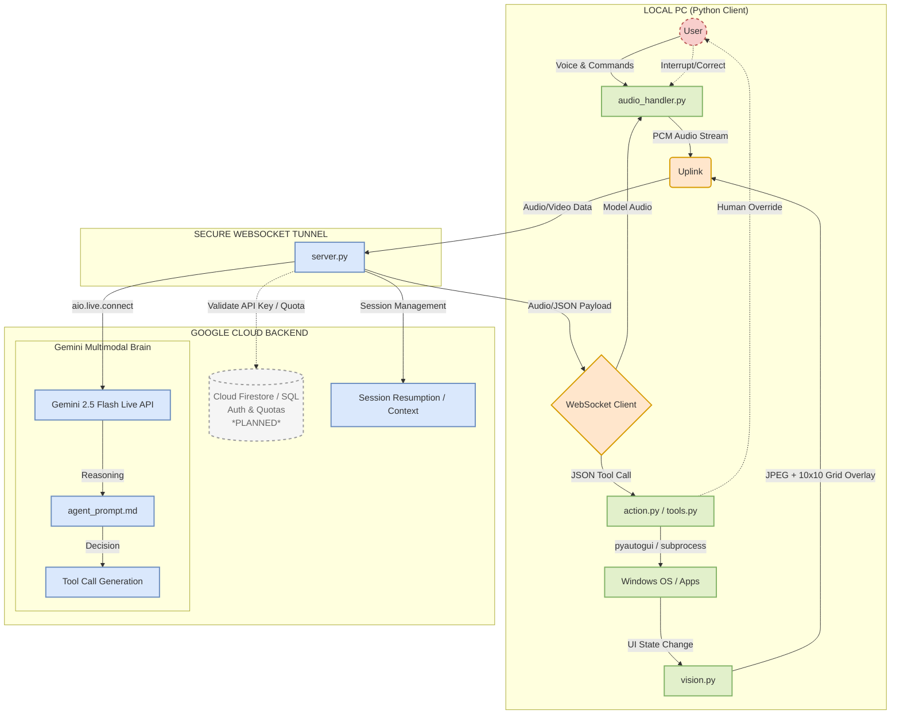

# Kazi-Agent: Multimodal Live UI Co-Pilot 🎙️☸️

> **A real-time, voice-driven UI navigator that solves the "last-mile" of automation by keeping the human in the loop via live multimodal feedback and visual grounding.**

Built for the **Google Gemini Live Agent Challenge**.

[](https://youtu.be/BnsdTORLwww)

[](https://github.com/Solomon-Nderit/kazi-agent/releases/download/v1.1.0/KaziAgent.exe)
> **No install needed.** Download, run, and press `Ctrl + Alt + A` to activate. Requires Windows 10/11.

---

## 🛑 The Problem with "Autonomous" Agents
Handing an autonomous vision model the keys to your OS or a production CRM is dangerous. Vision models hallucinate, and web pages load unpredictably. **Kazi-Agent** is built on a different thesis: we don't need agents that replace the user's intent—we need agents that safely execute it via high-bandwidth, multimodal collaboration.

Kazi-Agent acts as your hands on the screen, but it constantly relies on your voice for real-time course correction, confirmations, and guidance.

## 🏗️ Architecture: Separating the "Brain" from the "Hands"

To ensure security and speed, Kazi-Agent physically separates cloud reasoning from local OS execution. 


<details>
<summary><b>View Mermaid.js Source</b></summary>


</details>

## ✨ Key Features
1. **The Human-in-the-Loop Protocol:** Kazi-Agent verbally outlines its plan before clicking. If it makes a mistake, use the live audio stream to say "Wait, stop!" to instantly trigger the `abort_current_task` tool.
2. **Visual Grounding (10x10 Grid):** The local client uses OpenCV to draw a bright red coordinate grid over the screen before sending it to the cloud. This gives Gemini explicit spatial grounding to interpolate exact `[y, x]` coordinates, drastically reducing visual hallucinations.
3. **The Programmatic Pivot:** Visual clicking is inherently slow. Kazi-Agent is equipped with CLI tools (`run_shell_command`, `read_text_file`) and is instructed to prefer keyboard navigation (`tab` and `enter`) over visual clicks whenever possible for much faster execution.
4. **Infinite Token Sliding:** Streaming images exhausts context windows quickly. The GCP server uses `context_window_compression` and `session_resumption` to maintain the conversational state indefinitely.

---

## 🛠️ Reproducibility: Spin-Up Instructions

> **Just want to try it?** Download `KaziAgent.exe` above — no setup needed. It connects to our hosted cloud backend automatically.
>
> **Want to self-host?** Follow the steps below to run the full stack locally with your own Gemini API key.

We use [`uv`](https://github.com/astral-sh/uv) for lightning-fast Python dependency management.

### Prerequisites
* Python 3.10+
* `uv` installed (`pip install uv` or via curl)
* A Google Gemini API Key (with access to `gemini-2.5-flash-native-audio-preview-12-2025`)
* *(Windows 10/11 recommended for `pyautogui` and `pygetwindow` compatibility)*

### 1. Installation
```bash
git clone https://github.com/Solomon-Nderit/kazi-agent.git
cd kazi-agent
uv sync
```

### 2. Environment Setup
Create a `.env` file inside the `cloud/` directory:
```env
GOOGLE_API_KEY=your_api_key_here
PORT=8765
```

### 3. Run the System
Start the server and client in two separate terminals.

**Terminal 1 — The Brain (Cloud Server):**
```bash
cd cloud
uv run python server.py
```

**Terminal 2 — The Hands (Local Client):**
```bash
cd local
uv run python client.py
```

> **Note:** `client.py` connects to `ws://localhost:8765` by default — you must have the server running locally. The pre-built `.exe` connects to the hosted backend instead.

### 4. How to Use
1. Once both scripts are running, press `Ctrl + Alt + A` to activate the agent's listening mode.
2. Speak your command clearly (e.g., *"Kazi, look at the PDF on the left and type the invoice number into the spreadsheet on the right."*)
3. **Tip:** Allow the agent 2–3 seconds to process the visual grid before issuing rapid follow-up commands to account for UI settling time.

---

## 🚀 Future Roadmap & Known Limitations
Kazi-Agent is a prototype for the future of collaborative desktop automation. Our immediate roadmap includes:
- [ ] **Enterprise Auth & Quotas:** Integration with **Google Cloud Firestore** to manage user authentication and per-user API quota limits to prevent abuse.
- [ ] **Multi-Monitor Support:** Extending `vision.py` to handle dynamic monitor indexing and unified coordinate mapping across multiple screens.
- [ ] **Self-Healing Workflows:** Implementing a "Recovery Persona" where the agent automatically attempts an alternative programmatic path if a visual verification step fails.
- [ ] **Local LLM Fallback:** Integrating a local SLM to handle basic UI tasks when network latency is high, only calling the **Gemini Live API** for complex multimodal reasoning.